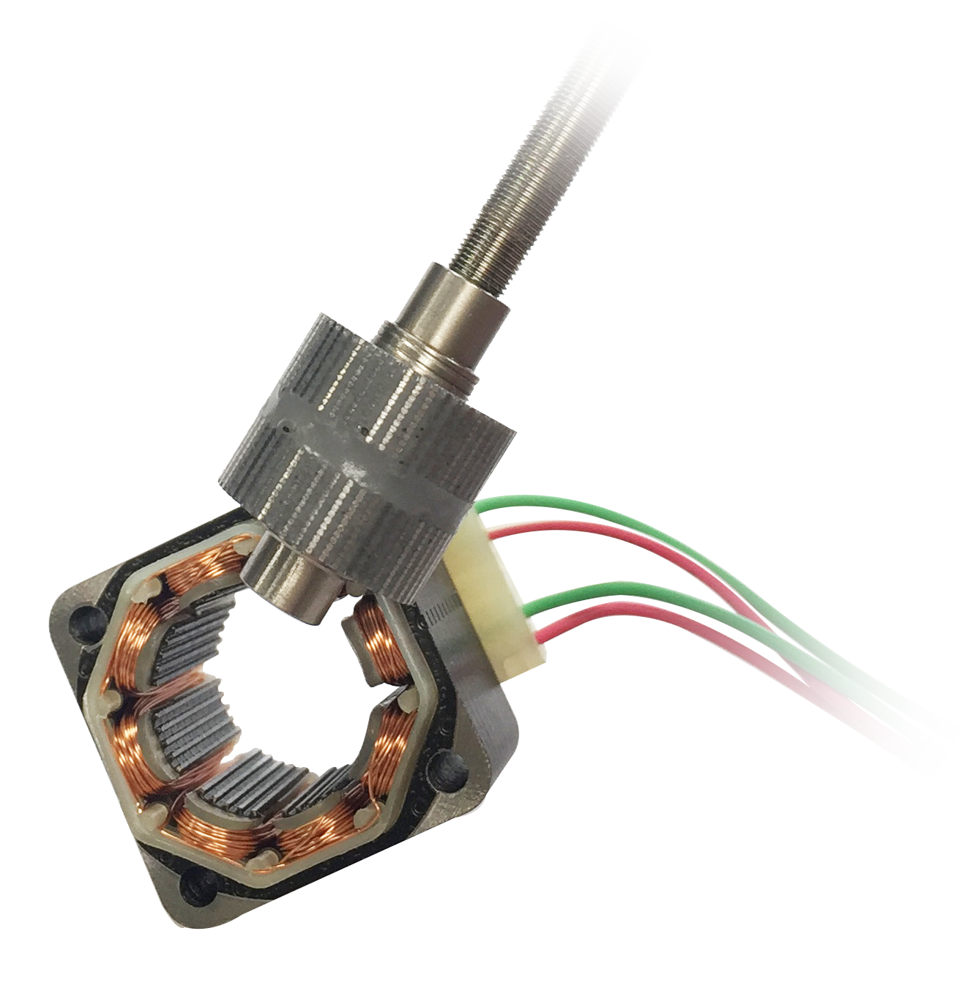
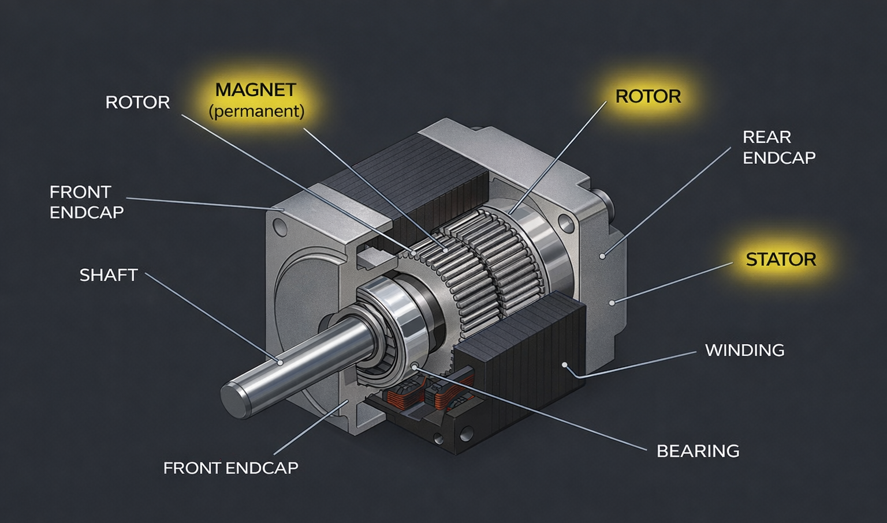
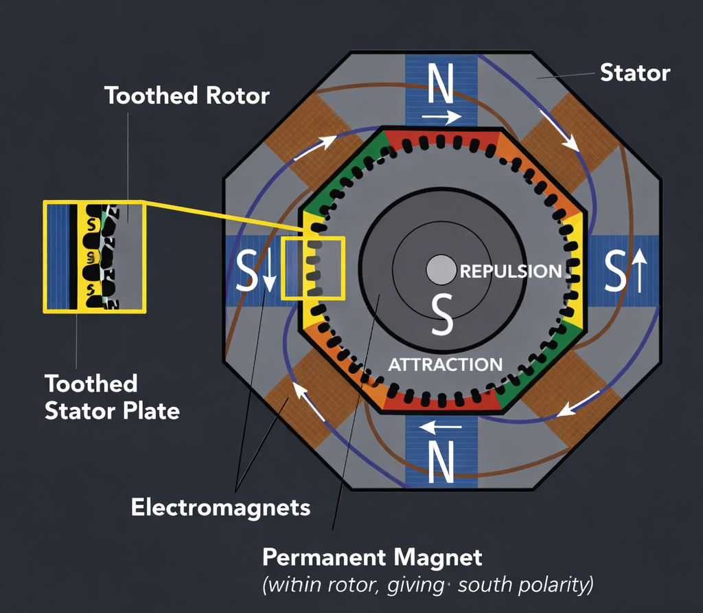

# Stepper Motor Control with Acceleration and Deceleration Profiles

## Definition  

A stepper motor is an electromechanical device that converts electrical signals into discrete angular movements. Instead of rotating continuously, it moves in fixed steps, which allows precise position control.  

A stepper motor consists of a rotor, stator, and coils. The rotor is the rotating part, while the stator is stationary and contains the coils. When the coils are energized, they generate a magnetic field that causes the rotor to move.  

This structure enables the motor to produce controlled motion that is directly compatible with digital systems.

---

## Stepper Motor Visualization

<div align="center">

<table>
  <tr>
    <!-- LEFT SIDE -->
    <td align="center" width="420">
      <br><br>
      <br><br>
      <b>General View</b>
    </td>
    <td align="center" width="420">
      <br><br>
      <b>Diagram of a Stepper Motor</b>
    </td>
  </tr>
  <tr>
    <td colspan="2" align="center">
      θ = 360° / N &nbsp;&nbsp; =&gt; &nbsp;&nbsp; θ = 360° / (2 × Rotor Teeth × Stator Phases)<br>
      (N: Number of steps per revolution)
    </td>
  </tr>
</table>

</div>

For example, if a motor has 200 steps per revolution:

θ = 360° / 200 = 1.8°

This means each step rotates the motor shaft by 1.8°, defining the resolution of motion.

---

## Working Principle  

A stepper motor operates by energizing the stator coils in a specific sequence. Each energized coil generates a magnetic field, and the rotor aligns itself with that field.  

By changing the sequence of coil activation, the rotor moves accordingly. Since this motion occurs step by step, the motor produces discrete but controlled rotation.  

Repeating this process continuously results in rotational motion.

---

## Speed Control and Timing  

Motor speed is directly controlled by the delay between steps. In general, shorter delays produce higher stepping frequency, while longer delays produce lower stepping frequency.

f ∝ 1 / delay  

- Higher frequency → higher speed  
- Lower frequency → lower speed  

This establishes a direct relationship between software timing and motion control.

---

## Driving Methods  

**Full Step**  
Coils are energized in a fixed sequence, producing constant step angles. This method provides high torque but lower resolution.  

**Half Step**  
Coils are energized alternately in single and combined states, resulting in smaller step sizes and improved resolution.  

**Microstepping**  
Coil currents are varied gradually, allowing smoother motion, higher precision, and reduced vibration.

---

## Step Control  

The rotation direction of the motor is determined by the order of the phase sequence.

| Step | Clockwise | Counterclockwise |
|------|-----------|------------------|
| 1    | 1 1 0 0   | 0 0 1 1          |
| 2    | 0 1 1 0   | 0 1 1 0          |
| 3    | 0 0 1 1   | 1 1 0 0          |
| 4    | 1 0 0 1   | 1 0 0 1          |

---

## Code Implementation

### stepper_speed_up_down  

In this version, the motor first accelerates and then decelerates.  

The delay between steps is decreased linearly to increase speed, and after a threshold, it is increased to slow the motor down.  

### stepper_speed_down_up  

In this version, the motor first decelerates and then accelerates.  

The delay is initially increased to reduce speed, then decreased to speed up the motor.  

### Pseudo Code  

```text
Initialize system
Load step sequence
Set delay value
Set step counter

Loop:
    Wait until device is ready

    Apply delay

    If step count < threshold:
        Adjust delay (increase or decrease)
    Else:
        Reverse delay behavior

    Output next step to motor (write to I/O port)

    Update step index
    Increment step counter

    If step counter < limit:
        Repeat loop
    Else:
        Stop
```

---

## Development Environment
This experiment was implemented using 8086 assembly language in a simulation environment. No physical stepper motor hardware was used. The program simulated stepper motor control by sending phase sequence values to an output port and varying the delay in software.

---

## Observation

In this experiment, the working principle of a stepper motor and its control logic were studied. By applying phase sequences to the output port, the stepping behavior was simulated.
It was observed that motor speed can be controlled by adjusting the delay between steps. This demonstrates how software timing directly affects motion control in embedded systems.

---

## References

1. **AMCI**, *What is a Stepper Motor*.  
   https://www.amci.com/industrial-automation-resources/plc-automation-tutorials/what-stepper-motor/  

2. **AMCI**, *Stepper vs Servo*.  
   https://www.amci.com/industrial-automation-resources/plc-automation-tutorials/stepper-vs-servo/  

3. **Clippard**, *How Stepper Motors Provide Precision Control*.  
   https://www.clippard.com/cms/wiki/how-stepper-motors-provide-precision-control  

4. **RS Online**, *Full Step, Half Step and Microstepping*.  
   https://www.rs-online.com/designspark/stepper-motors-and-drives-what-is-full-step-half-step-and-microstepping  

5. **GeeksforGeeks**, *Applications of Stepper Motor*.  
   https://www.geeksforgeeks.org/electrical-engineering/applications-of-stepper-motor/  

6. **Monolithic Power Systems**, *Stepper Motors: Basics, Types and Uses*.  
   https://www.monolithicpower.com/en/learning/resources/stepper-motors-basics-types-uses  

7. **Anaheim Automation**, *Stepper Motor Guide*.  
   https://anaheimautomation.com/blog/post/stepper-motor-guide  

8. **Scribd**, *Stepper Motor Notes*.  
   https://www.scribd.com/document/942227267/Sem-Unit-2-Stepper-Motor  

9. **Karadeniz Technical University**, *Computer Organization Laboratory Documentation*.  

10. **GitHub — Yıldız Büşra**, *Organization Lab (Stepper Motor)*.  
    https://github.com/yildiz-busra/Organizasyon-Lab/tree/main/Ad%C4%B1m-Motoru  
