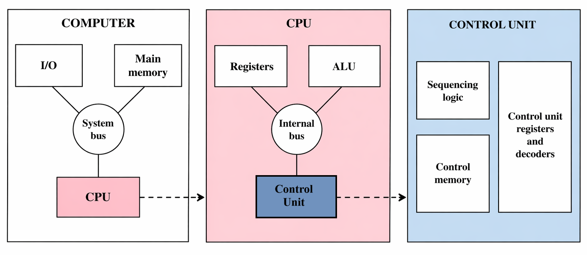
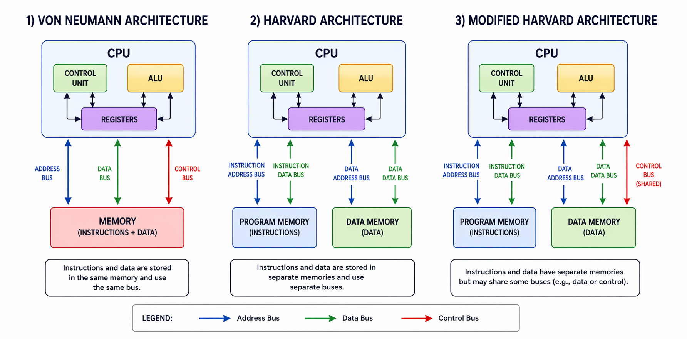

# Computer Architecture  

The scope of the Computer Architecture course includes organization and architecture, structure and function, the brief history of computers, the evolution of the Intel x86 architecture, embedded systems, ARM architecture, performance considerations and design criteria, multicore systems, GPUs, Amdahl’s Law, Little’s Law, fundamental performance metrics, benchmarking and SPEC, interconnection technologies such as bus structures, point-to-point communication and PCI Express, cache memory design and organization (including Pentium 4), external memory systems such as magnetic disks, RAID, solid-state drives and optical storage, as well as input/output mechanisms including programmed I/O, interrupt-driven I/O, Direct Memory Access (DMA), and Direct Cache Access (DCA).

---

## Repository Structure  

This repository is structured to cover computer architecture topics both theoretically and practically.
Theoretical concepts are directly reinforced through low-level implementations, allowing a deeper understanding of how systems operate at the hardware level. 

---

## Purpose of This Repository  

The goal of this repository is to concretize the concepts covered in the course through laboratory experiments and projects, demonstrating how hardware operates and how the interaction between components determines overall system behavior.

---

## Definition  

A computer system can be understood as a layered abstraction, but these layers should certainly not be interpreted as linear. Instead, they form a hierarchy of abstraction levels:

Transistors → Logic Gates → Digital Circuits → Microarchitecture → Instruction Set Architecture → Computer System

At the lowest level, transistors function as the fundamental physical building blocks. These combine to form logic gates, and these logic gates in turn form digital circuits such as adders, registers and control units. The CPU is in constant interaction with memory to process data; communication with the external environment is facilitated via input/output (I/O) devices.

All these components come together to form a computer system. The interaction between these components determines the system’s behaviour. Overall performance is directly determined by how these interactions are designed and optimised. Computer architecture is not merely about defining the components but also involves understanding how they work together as a system.

As a discipline, computer architecture focuses on how these components are organised, how they communicate, and how performance can be optimised through design decisions.

There are two fundamental approaches to analysing a system. The bottom-up approach, which starts with the lowest-level components, or the top-down approach, which begins with the overall system and breaks it down into smaller subsystems. In practice, the top-down approach is generally more effective and has been adopted throughout this course.  

  
   
  <em>Computer system hierarchy and component interaction</em>

---

## Architecture Models  

Early computers were designed as special-purpose systems intended to solve specific problems, and the concept of a program, as understood today, did not exist. The behavior of these machines was determined through physical wiring, switches, and manual configuration, which severely limited flexibility.

A fundamental breakthrough occurred in 1945 with the introduction of the stored-program concept. This approach allowed programs to be stored in memory alongside data, enabling computers to solve different problems without requiring physical reconfiguration. This model forms the basis of the Von Neumann Architecture, where both instructions and data reside in the same memory and are transferred over a shared bus.

However, this design introduces a key limitation: the processor cannot access instructions and data simultaneously due to the shared memory and bus. This limitation is known as the Von Neumann bottleneck and directly impacts system performance.

To address this issue, the Harvard Architecture was developed, separating instruction and data memories as well as their respective buses. This allows simultaneous access to instructions and data, improving performance at the cost of increased complexity and design overhead.

Modern systems adopt a hybrid approach that combines the advantages of both models. While they appear externally as Von Neumann systems with unified memory, internally they separate instruction and data paths at the cache level, achieving parallelism similar to Harvard architecture. This approach is known as the Modified Harvard Architecture and represents the most widely used design in contemporary systems.

  
   
  <em>Comparison of Memory Architectures</em>

---

## Evolution of Computer Hardware  

### The First Generation: Vacuum Tubes  

First-generation computers relied on vacuum tubes for implementing digital logic and memory. This technology enabled the development of both research-oriented and commercial machines, with the IAS computer being one of the most well-known examples.

### The Second Generation: Transistors  

The first major transformation in electronic computing occurred with the replacement of vacuum tubes by transistors. Transistors are significantly smaller, more cost-efficient, and generate less heat compared to vacuum tubes, while performing the same functions more reliably. Unlike vacuum tubes, transistors do not require glass enclosures, vacuum environments, or bulky metal structures; instead, they are solid-state devices based on semiconductor materials such as silicon.

Invented at Bell Labs in 1947, transistors initiated the electronic revolution of the 1950s. Each new generation of computers was characterized by higher performance, increased memory capacity, and reduced physical size. Additionally, the second generation introduced more advanced arithmetic and control units, high-level programming languages, and system software. These developments laid the foundation for modern operating systems that manage program execution, data handling, and hardware control. 

### The Third Generation: Integrated Circuits  

As the demand for computational power increased, assembling systems from discrete transistors became inefficient, costly, and complex. The need to individually solder components onto circuit boards introduced scalability and reliability challenges.

In 1958, a major breakthrough occurred with the invention of the integrated circuit (IC), marking the beginning of the third generation of computers. Integrated circuits allow multiple electronic components—such as transistors, resistors, and interconnections—to be fabricated directly onto a single semiconductor substrate.

This innovation eliminated the need for assembling individual components and significantly reduced system size, cost, and complexity. Initially limited to small-scale integration (SSI), advances in fabrication technology enabled increasingly higher transistor densities on a single chip. This trend is described by Moore’s Law, which states that the number of transistors on a chip approximately doubles every 18–24 months.

As a result, systems became faster, smaller, more energy-efficient, and more reliable due to reduced physical interconnections.

In summary, the evolution from vacuum tubes to transistors and then to integrated circuits represents a continuous effort to overcome the physical and operational limitations of earlier technologies. Each generation improved performance, scalability, efficiency, and reliability, enabling the development of modern high-performance computing systems.

---

## Architecture vs Organization  

Computer systems are commonly described in terms of computer architecture and computer organization, which represent two distinct but closely related perspectives.

Computer architecture refers to the attributes of a system that are visible to the programmer and directly affect program execution. This includes the instruction set architecture (ISA), which defines instruction formats, opcodes, registers, memory structures, and the behavior of instructions.

Computer organization, on the other hand, describes how these architectural features are implemented in hardware. It includes the internal operational units, interconnections, control signals, and hardware-level mechanisms that are typically hidden from the programmer.

While multiple systems may share the same architecture, they can differ significantly in organization, leading to variations in cost and performance. Over time, a single architecture may be implemented using different organizational designs as technology evolves.

In microcomputer systems, the distinction between architecture and organization becomes less rigid, as technological advancements influence both simultaneously, enabling the development of more complex and powerful systems.

---

## System Perspective 

A computer system is inherently complex and consists of millions of electronic components. In order to understand such complexity, systems are analyzed through a hierarchical structure, where each level is composed of smaller subsystems down to the most fundamental building blocks. Within this hierarchy, two fundamental concepts are considered at every level: structure and function. Structure refers to how components are organized and interconnected, while function defines the operations performed by the system. Computer architecture focuses on how structure enables function and how their interaction determines overall system behavior and performance. 

From a functional perspective, a computer performs four essential operations. It processes data through arithmetic and logical transformations, stores data either temporarily or permanently, transfers data between internal components or external devices, and controls system operations by coordinating all components according to instructions. Despite the apparent complexity of modern systems, these four functions form the foundation of all computational behavior. 

From a structural perspective, a traditional computer system is composed of four main components. The central processing unit (CPU) executes instructions and performs data processing operations. Main memory stores both data and instructions required during execution. Input/output (I/O) devices enable communication between the computer and the external environment. These components are connected through a system interconnection mechanism, commonly implemented as a bus, which facilitates communication between the CPU, memory, and I/O units. 

---

## The Evolution of the Intel x86 Architecture 

The Intel x86 architecture has evolved over decades as a strong example of the CISC (Complex Instruction Set Computer) approach. This evolution began with the 8080, continued with the introduction of the x86 architecture through the 8086, advanced to a 32-bit design with the 80386, introduced parallel execution with the Pentium, and progressed to multi-core architectures with the Core series. Over time, clock speeds have increased by hundreds of times, and transistor counts have reached into the billions. Despite these changes, one of the most critical features of x86 is its backward compatibility, allowing older software to run on newer systems. Today, x86 remains dominant in the processor market outside of embedded systems. 

## ARM Architecture 

The ARM architecture is a processor architecture based on RISC principles and widely used, particularly in embedded systems and mobile devices. It is designed by ARM Holdings and licensed to manufacturers. Thanks to its low power consumption, small chip footprint and high efficiency, it is the preferred choice for smartphones, IoT devices and many electronic systems. ARM’s Cortex family is divided into three main groups: the Cortex-A series for high-performance applications, the Cortex-R series for real-time systems, and the Cortex-M series for microcontroller-based applications. The Cortex-M series, in particular, integrates the processor, memory and peripheral units onto a single chip, offering efficient and compact solutions for embedded systems.

## Embedded Systems 

Embedded systems are hardware and software systems integrated into a specific product, unlike general-purpose computers. Today, billions of devices—including smartphones, automobiles, and household appliances—contain embedded systems. These systems are typically real-time, reactive (continuously interacting with their environment), and highly optimized for efficiency. They communicate with the external world through sensors and actuators. Although their software is usually designed for a specific purpose, modern embedded systems are increasingly capable of being updated and running applications, as seen in devices such as smartphones and smart TVs. 

## Microprocessor and Microcontroller

A microprocessor (CPU) is a general-purpose processing unit with high computational power that requires external memory and peripheral components to operate. A microcontroller, on the other hand, is a compact computer that integrates the CPU, RAM, ROM, and I/O ports on a single chip, making it low-cost and specialized for embedded systems. Microprocessors are typically used in computers, whereas microcontrollers are used in specific devices such as household appliances. 

---

## References  

1. William Stallings, *Computer Organization and Architecture: Designing for Performance*, 10th Edition, Pearson.  

2. Patterson, D. A., & Hennessy, J. L.  
*Computer Organization and Design: The Hardware/Software Interface*.  
Morgan Kaufmann.

3. "Vacuum Tube Audio Explained"  
   https://www.crutchfield.com/S-PffZwxT7XvH/learn/vacuum-tube-audio-explained.html  

4. "History of Computer Development – Vacuum Tubes Era"  
    https://elanina.narod.ru/lanina/ind/history/p1_11.htm 

 
