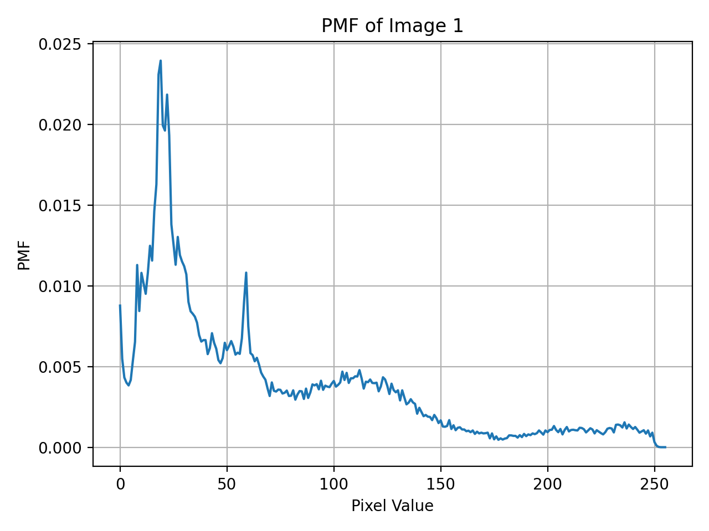

# PMF Analysis of Grayscale Images  

## Objective and Assignment Description

The objective of this assignment is to statistically analyze the pixel intensity values of grayscale digital images and to investigate the effect of image summation on probability distributions. Within this scope, a total of ten images obtained from the internet are used. All images are converted to 256×256 resolution and 8-bit grayscale format prior to the analysis.

First, the probability mass function (PMF) of the pixel intensity values is computed and plotted separately for each image. Then, the pixel values of four selected images are added in a pixel-wise manner to form a new image, and the PMF of this summed image is computed and plotted. The same procedure is repeated for eight images and for ten images, and the PMFs of the resulting summed images are obtained in each case.

In the final stage, the PMFs of individual images are compared with the PMFs of the summed images obtained from 4, 8, and 10 images. The changes in the statistical distributions as the number of images increases are observed, and the results are reported.

---

## Input Format

The input consists of digital image files obtained from the internet. The images may be either color or grayscale and may have different resolutions. Within the application, all input images are automatically resized to 256×256 and converted to 8-bit grayscale format. After these preprocessing steps, each image is analyzed as a grayscale image with pixel intensity values in the range of 0–255.

---

## Code Implementation and Rationale for Choosing Python

This assignment is implemented using the Python programming language, as it is primarily focused on statistical analysis and visualization. Python’s NumPy library enables clear and reliable computation of histograms and PMFs from pixel intensity values, while the Matplotlib library allows PMF plots to be generated in a clear and academically appropriate manner.

In the implementation, each input image is read from file, converted to grayscale if necessary, and resized to 256×256. Histogram and PMF computations are then performed. During image summation, pixel-wise addition is carried out using appropriate data types in order to prevent overflow. The capabilities provided by Python allow the implementation to focus directly on the core objectives of the assignment—statistical analysis and observation—without being distracted by low-level format or memory management details.

---

## Pseudo Code

```text
Initialize:
    targetWidth        ← 256
    targetHeight       ← 256
    totalPixels        ← targetWidth × targetHeight
    numberOfImages     ← 10
    imageSet           ← empty list

For each input image file until numberOfImages is reached:
    Read image from file
    If image is not grayscale:
        Convert image to 8-bit grayscale
    Resize image to 256×256
    Store processed image in imageSet

For each image I in imageSet:
    Initialize histogram[0..255] to zero
    For each pixel value p in image I:
        histogram[p] ← histogram[p] + 1
    For k from 0 to 255:
        pmf[k] ← histogram[k] / totalPixels
    Plot pmf

For K in {4, 8, 10}:
    Initialize summedImage to zero
    For first K images:
        Perform pixel-wise summation
    Compute histogram and PMF of summedImage
    Plot PMF of summedImage

```

## Example Results

The figure below illustrates an example input image, its grayscale representation, and the corresponding PMF.  
The grayscale image is obtained after converting the input image to 8-bit intensity values in the range 0–255.  
The PMF represents the probability distribution of pixel intensities in the grayscale image.

| Input Image | Grayscale Image | PMF |
|------------|-----------------|-----|
|  |  |  |


## References

1. **R. C. Gonzalez and R. E. Woods**,  
   *Digital Image Processing*, 4th ed., Pearson, 2018.  

2. **Python Imaging Library (Pillow)**,  
   https://pillow.readthedocs.io/  

3. **Wikipedia contributors**,  
   *Probability Mass Function*.  
   https://en.wikipedia.org/wiki/Probability_mass_function  

4. **Athanasios Papoulis and S. Unnikrishna Pillai**,  
   *Probability, Random Variables, and Stochastic Processes*, 4th ed., McGraw-Hill, 2002.  

5. **Wikipedia contributors**,  
   *Central Limit Theorem*.  
   https://en.wikipedia.org/wiki/Central_limit_theorem  

6. **A. V. Oppenheim and R. W. Schafer**,  
   *Discrete-Time Signal Processing*, 3rd ed., Pearson, 2010.  

7. **S. W. Smith**,  
   *The Scientist and Engineer’s Guide to Digital Signal Processing*,  
   California Technical Publishing, 1997.  
   Available online: https://www.dspguide.com/  
   *(Histogram, PMF, and statistical analysis of discrete-time signals)*

8. **Python Software Foundation**,  
   *NumPy Documentation*.  
   https://numpy.org/doc/  

9. **Hunter, J. D.**,  
   “Matplotlib: A 2D Graphics Environment,”  
   *Computing in Science & Engineering*, vol. 9, no. 3, pp. 90–95, 2007.  
