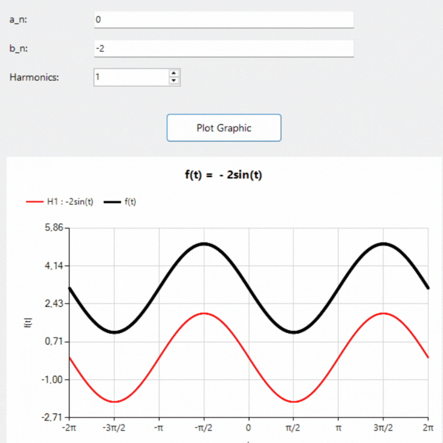

# Fourier Series Visualization

This project demonstrates the graphical visualization of a Fourier series constructed from user-defined harmonic coefficients.

---

## Objective
The objective of this project is to numerically evaluate and visualize a Fourier series using user-provided Fourier coefficients. The program allows the user to define the number of harmonics and the corresponding sine and cosine coefficients, and then computes the resulting signal over a specified time interval. The graphical output illustrates how harmonic components combine to form the final waveform.

---
## Mathematical Model

The implemented Fourier series corresponds to the trigonometric representation

$$
f(t) = \frac{a_0}{2} + \sum_{n=1}^{N} \left( a_n \cos(n\omega_0 t) + b_n \sin(n\omega_0 t) \right)
$$


| Symbol | Description |
|------|-------------|
| $T$ | Period of the signal |
| $a_0$ | Constant (DC) component |
| $a_n$ | Fourier cosine coefficients |
| $b_n$ | Fourier sine coefficients |
| $N$ | Number of harmonics used in the approximation |
| $\omega_0$ | Fundamental angular frequency |
| $\omega_0 = \frac{2\pi}{T}$ | Relation between angular frequency and period | Fundamental angular frequency 

|

---

## Input Format
In this application, the user specifies the parameters of the Fourier series through a graphical interface. The user manually enters the number of harmonics $N$, the signal period $T$, and the constant coefficient $a_0$, while the Fourier cosine coefficients $a_n$ and sine coefficients $b_n$ for 
$n = 1,2,\dots,N$ are entered as comma-separated values. Based on these parameters, the program constructs a truncated Fourier series and computes the signal values over a discrete set of time samples.

---

## Code Implementation


### Pseudo Code

```text
Read N
Read period T
Read coefficients a0, an, bn

Compute fundamental frequency

w0 = 2π / T

Generate time samples

for each time t

    sum = a0/2

    for n=1..N
        sum += an*cos(n*w0*t)
        sum += bn*sin(n*w0*t)

    store (t,sum)

Plot results

```
---

## Key Observations from Implementation
Each harmonic component represents a sinusoidal signal with frequency $n\omega_0$, and the final waveform is obtained by superposing these individual harmonic contributions. As the number of harmonics increases, the truncated Fourier series provides a progressively better approximation of the reconstructed signal. Lower-frequency harmonics primarily determine the global structure of the waveform, while higher-frequency components refine the detailed features of the signal. The graphical visualization produced by the program clearly illustrates how these harmonic components combine to form the final signal through the principle of superposition.

---

## Example Results

The animation below illustrates how the Fourier series approximation improves as the number of harmonics increases.



---

## References

1. Glyn James, Advanced Modern Engineering Mathematics, 4th Edition, Pearson Education.

2. locogame, Coding a Fourier Transform in C, YouTube Tutorial Series.

3. Microsoft, System.Windows.Forms.DataVisualization.Charting Namespace Documentation, .NET Framework Documentation.

4. Rab McMenemy, Creating a Fourier Transform Function in C: A Step-by-Step Guide, Medium. Rab McMenemy, Creating a Fourier Transform Function in C: A Step-by-Step Guide, Medium.

5. ProgrammingKnowledge, *C++ WinForms in Visual Studio 2019 | Getting Started*, YouTube.  
https://www.youtube.com/watch?v=gB51Tla5pPI
